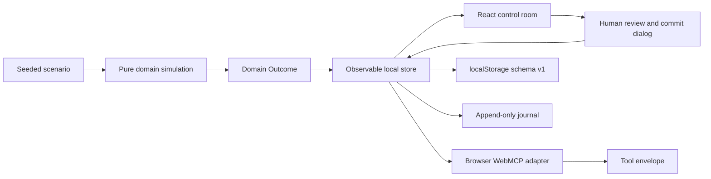

# WattKeep

WattKeep is a fictional, anonymous, deterministic, local-first household outage-resilience planner for the OpenAI WebMCP Challenge.

> You decide what must stay on. WattKeep makes the stored energy last.

It gives a household a small, inspectable control room for an outage plan. The app shows the current household, battery, solar forecast, and loads; simulates competing plans; explains the battery accounting for each interval; and stages a proposal with a visible before-and-after diff. A review request can be made by the page tools, but applying the policy always requires a visible human action in the interface.

## Product story

The Morgan household starts an evening outage with a 13.5 kWh battery at 10.53 kWh, or 78 percent, and protects a 2.70 kWh, or 20 percent, reserve. The seeded outage runs from 18:00 to 06:00 across 12 hourly intervals. WattKeep makes the trade-off legible:

| Plan | End energy | Reserve result | First breach |
| --- | ---: | --- | --- |
| Essential Reserve | 8.09 kWh | Feasible | None |
| Balanced Night | 6.97 kWh | Feasible | None |
| Comfort Carry | 0.67 kWh | Not feasible | 02:00 to 03:00 |

The result is a planning decision, not a hidden automation. The agent can gather evidence and prepare a proposal. The person at the control room decides whether that proposal is committed.

## Three-minute demo flow

1. Inspect the Morgan household, battery, reserve, outage window, and forecast.
2. Compare Essential Reserve, Balanced Night, and Comfort Carry.
3. Explain an interval to show the solar, load, and closing-energy accounting.
4. Select Balanced Night and stage it as a visible proposal.
5. Request review and inspect the immutable Before and After policy diff.
6. Pause at the human commit boundary. Only the person can open confirmation and commit.
7. Confirm the policy, then use the human Undo latest change control to restore Essential Reserve.
8. Refresh the forecast to make a proposal stale, then restage by the exact proposal ID or discard it.

The complete timed script is in [docs/DEMO_SCRIPT.md](docs/DEMO_SCRIPT.md).

## Quick start

Use Node.js and npm, then run these commands from the cloned repository:

```bash
npm ci
npm run dev
```

Open the local URL printed by Vite. For a production build and local preview:

```bash
npm run build
npm run preview
```

The application is anonymous and local-first. It does not need an account, backend, device connection, or external service.

### Built with

| Area | Version or library |
| --- | --- |
| UI | React 19.2.8 and React DOM 19.2.8 |
| Build | Vite 8.2.2 |
| Language | TypeScript 7.0.2 |
| Unit and component tests | Vitest 4.1.11 with Testing Library |
| Browser tests | Playwright 1.62.1 |
| Accessibility checks | axe-core 4.13.0 through `@axe-core/playwright` |

The package lock records the exact dependency versions used by the reproducible install.

## WebMCP tools

WattKeep exposes exactly eight page-scoped tools when `document.modelContext` is available and all registrations succeed. Their schemas, descriptions, and annotations are interfaces for interoperability. They are not security controls.

| Tool | Purpose | Changes committed policy? |
| --- | --- | --- |
| `inspect_home` | Read the household, battery, loads, current policy, and proposal summary. | No |
| `inspect_outage` | Read the outage window, hourly intervals, and solar forecast. | No |
| `simulate_plan` | Simulate one plan for the current scenario and cache its evidence. | No |
| `compare_plans` | Rank two or three plans by reserve safety, coverage, and closing charge. | No |
| `stage_plan` | Stage a feasible simulation as a visible proposal. | No |
| `explain_interval` | Explain one interval from a cached simulation. | No |
| `discard_plan` | Discard the active proposal without applying a household policy. | No |
| `request_review` | Move the active proposal to human review. | No |

There is deliberately no `approve_plan`, `commit`, or `undo` tool. The human UI alone creates the commit capability, commits a reviewed proposal, refreshes the forecast, resets a session, and undoes the latest eligible commit.

Tool calls return stable structured envelopes with the tool name, either data or a recoverable error, and a compact live state summary. Input validation rejects unknown properties, malformed IDs, duplicate plans, invalid intervals, and invalid plan counts. Recoverable outcomes include a code, a clear message, and suggested next actions.

## Safety boundary

WattKeep separates planning from applying a policy:

- Query and planning tools operate on the current page store. Staging produces an immutable proposal with assumptions, simulation evidence, and a before-and-after load-policy diff.
- A review request is visible in the Proposal desk. A proposal must be feasible and current before a human commit capability can be created.
- The commit dialog states that human approval is required. The agent cannot approve on the user's behalf.
- Proposal identity is tied to the exact proposal ID, workspace revision, scenario, and simulation fingerprint. A revision change or identity mismatch returns a recoverable stale or mismatch outcome instead of applying the proposal.
- The append-only journal records staging, review, forecast refresh, stale rejection, discard, commit, undo, and session reset events. Human undo restores the policy from the latest eligible commit and is itself journalled.
- A reset requires confirmation, starts a new session, and archives the prior session journal and snapshot. It does not commit an active proposal.

This is a deterministic planning demo. It has no backend, authentication, live telemetry, billing, messaging, real inverter control, or external mutation.

## Architecture overview

The application is a single top-level document built with React 19, Vite 8, and TypeScript 7. The observable store is the shared action and state layer for the React UI and the WebMCP adapter.



The boundaries are intentional:

1. `src/domain/scenario.ts` defines the frozen Morgan fixture, plans, loads, battery, outage, and solar values. `src/domain/simulation.ts` contains deterministic calculations for simulation, comparison, ranking, and interval explanations. These functions return pure domain `Outcome` values and do not commit state.
2. `src/state/store.ts` owns frozen observable snapshots, cached query evidence, proposals, committed workspace revisions, the journal, reset archives, and the separate agent and human command surfaces. Query work can populate an evidence cache without changing the committed workspace revision.
3. `src/webmcp/contracts.ts` defines the exact tool names, descriptions, JSON schemas, validation, and read-only annotations. `src/webmcp/register-tools.ts` adapts store outcomes into browser adapter envelopes shaped as `{ ok, tool, data }` or `{ ok, tool, error }`, each with live state. The adapter does not expose human-only commands.
4. `src/state/persistence.ts` stores the durable workspace fields in one namespaced localStorage envelope. Cached simulations and explanations are deliberately rebuilt after reload.
5. `src/App.tsx` and the components render the same store state used by tool calls. The Proposal desk owns the visible confirmation dialog, focus handling, human commit activation, discard, and commit outcome.

### Cancellation and registration lifecycle

Read-only domain operations check an `AbortSignal` before work and after their explicit asynchronous yield. The adapter also checks cancellation at invocation and after awaited read-only work. A mutating command is linearised at its store transition: if cancellation fires immediately after that transition, the successful mutation result is returned so the caller cannot mistake a committed state change for an aborted one.

WebMCP registration is all-or-nothing. A single lifecycle `AbortController` is passed to each page registration and is bound to the owning React effect before registration starts. Cleanup aborts that signal, which removes registered tools in a compliant host, including during a pending registration. If a later registration fails, cleanup runs and the app reports the manual interface rather than leaving a partial tool set.

### Persistence degradation

The store reads and writes the versioned `wattkeep:state:v1` localStorage envelope with `schemaVersion: 1`. Reload recovery includes the committed policy, active proposal, journal, archived sessions, and latest commit record. If storage is unavailable, unreadable, corrupt, an unknown version, or rejects a write or clear, the UI visibly switches to `Memory only`. The current session can still plan and commit, but the result is not durable across reload. localStorage provides reload recovery, not cross-tab consistency.

See [docs/ARCHITECTURE.md](docs/ARCHITECTURE.md) for the fuller state and adapter model.

## Accessibility and browser fallback

The interface uses labelled sections, semantic lists and definitions, visible status messaging, keyboard-operable controls, a modal dialog with focus trapping, Escape and backdrop cancellation, focus return to the invoker, and focus on the commit outcome. The layout is checked at 320, 390, 768, and 1440 CSS pixels without horizontal overflow.

`npm run test:a11y` uses axe-core assertions that require no serious or critical violations across the tested planning states. This threshold is useful automated evidence, not a claim of total WCAG certification. The intended reference is WCAG 2.2 and the WAI-ARIA modal dialog pattern.

The app feature detects `document.modelContext`. When WebMCP is absent, unavailable, or registration fails, the manual interface remains complete and visibly reports the reason. The automated browser proof uses system Chromium 151 in this environment with a contract-faithful fake `modelContext`. A local native WebMCP smoke has also completed in Chromium 151.0.7922.108 and stopped before human commit; a current ChatGPT in-app browser smoke remains a separate optional submission action, recorded in [docs/SUBMISSION_NOTES.md](docs/SUBMISSION_NOTES.md).

## Testing evidence

The current local verification set is:

| Command | Result |
| --- | --- |
| `npm run test:unit` | 62 unit and component tests pass |
| `npm run test:contracts` | 15 WebMCP contract tests pass |
| `npm run test:e2e` | 13 Playwright end-to-end tests pass |
| `npm run test:a11y` | Seven accessibility, responsive, and smoke tests pass |
| `npm run typecheck` | Passes |
| `npm run lint` | Passes |
| `npm run build` | Passes |

Run the same verification commands from the repository root:

```bash
npm run test:unit
npm run test:contracts
npm run test:e2e
npm run test:a11y
npm run typecheck
npm run lint
npm run build
```

The deterministic end-to-end coverage includes the WebMCP golden path, manual fallback, partial registration failure, cancellation, memory-only persistence, stale proposal rejection, restaging, discard, reset, undo, keyboard commit, focus behaviour, responsive layout, serious or critical axe checks, and a production-preview smoke navigation.

The Playwright configuration defaults to the system Chromium used for this project. On another machine, set `WATTKEEP_CHROMIUM_PATH` to a local Chromium or Chrome executable before running the browser commands.

## Challenge resources

- [OpenAI WebMCP Challenge](https://openai.com/webmcp-challenge/)
- [WebMCP Devpost](https://webmcp.devpost.com/)
- [WebMCP documentation on Learn](https://learn.chatgpt.com/docs/webmcp)
- [WebMCP Community Group specification](https://webmachinelearning.github.io/webmcp/)
- [Chrome WebMCP best practices](https://developer.chrome.com/docs/ai/webmcp/best-practices)
- [Chrome WebMCP secure tools guidance](https://developer.chrome.com/docs/ai/webmcp/secure-tools)
- [Web Content Accessibility Guidelines 2.2](https://www.w3.org/TR/WCAG22/)
- [WAI-ARIA Authoring Practices modal dialog pattern](https://www.w3.org/WAI/ARIA/apg/patterns/dialog-modal/)

## Public project documents

- [Architecture notes](docs/ARCHITECTURE.md)
- [Timed demo script](docs/DEMO_SCRIPT.md)
- [Submission notes and remaining actions](docs/SUBMISSION_NOTES.md)
- [MIT licence](LICENSE)

## Licence

WattKeep is released under the [MIT licence](LICENSE). Copyright 2026 Dewaldt Huysamen.
