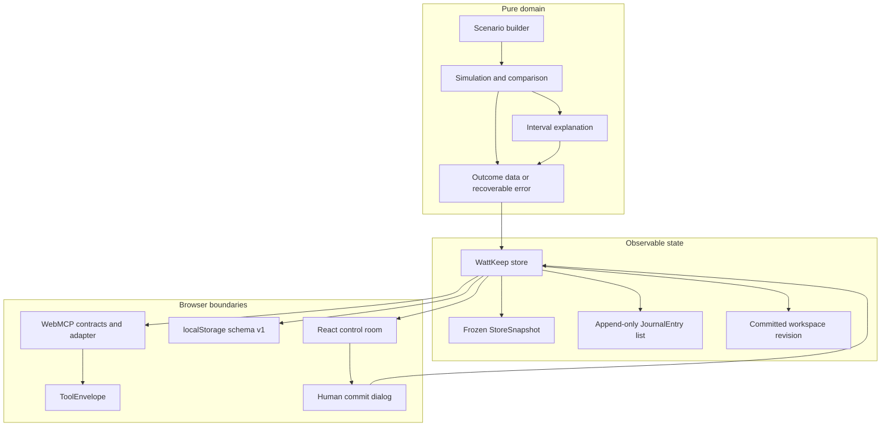

# WattKeep architecture

WattKeep is a single-document React application with a deterministic local store. The React UI and the page-scoped WebMCP tools use the same action layer, so a tool result and a manual action describe the same household state.

## Runtime shape



The layers have separate responsibilities:

| Layer | Source | Responsibility | State mutation |
| --- | --- | --- | --- |
| Domain | `src/domain/scenario.ts`, `src/domain/simulation.ts`, `src/domain/outcomes.ts` | Build the frozen fixture, calculate projections, rank plans, explain intervals, and return recoverable outcomes. | None |
| Store | `src/state/store.ts` | Coordinate scenario revisions, evidence caches, proposals, journal entries, committed policy, archives, human capabilities, and subscriptions. | Yes, through explicit commands |
| Persistence adapter | `src/state/persistence.ts` | Encode and validate the versioned localStorage envelope. | Durable browser storage only |
| WebMCP adapter | `src/webmcp/contracts.ts`, `src/webmcp/register-tools.ts` | Validate page inputs, invoke agent commands, and expose structured browser envelopes. | Planning state only; never commits |
| UI | `src/App.tsx` and `src/components/` | Render the store snapshot, expose manual fallback, and provide the visible human checkpoint. | Human commands can commit, refresh, undo, or reset |

## Pure domain outcomes

The canonical scenario is the Morgan household: a 13.5 kWh battery starts at 10.53 kWh and has a 2.70 kWh reserve. The 18:00 to 06:00 outage is represented as 12 one-hour intervals. The scenario builder returns frozen values so callers cannot alter the fixture.

Simulation is a pure calculation over a scenario and plan ID. For each interval it records solar input, active loads, load energy, energy delta, opening and closing energy, and reserve status. The result also carries a deterministic simulation ID and fingerprint. Comparison ranks plans by feasibility, reserve coverage, closing energy, and stable preset order. Interval explanation derives readable and accessible accounting text from a cached simulation.

Expected runtime problems use the domain `Outcome<Data>` shape:

```ts
{ ok: true, data }
{ ok: false, error: { code, message, nextActions } }
```

The domain returns codes such as `UNKNOWN_PLAN`, `INVALID_PLAN_COUNT`, `INVALID_INTERVAL`, `CANCELLED`, and `INTERNAL_ERROR`. This keeps malformed tool input and recoverable calculation failures visible without turning them into uncaught page errors.

## Observable store and revisions

`createStore` builds one frozen `StoreSnapshot` and publishes a new snapshot after each state transition. React subscribes with `useSyncExternalStore`; WebMCP reads the same snapshot when it constructs its compact tool state.

The store keeps separate agent and human command surfaces. Agent commands can inspect, simulate, compare, explain, stage, request review, and discard. Human commands can create an opaque commit capability, commit it, refresh the forecast, undo the latest eligible commit, and reset the session.

The `workspaceRevision` is the monotonic revision of the current planning workspace. It starts at 1 and increases for a forecast refresh, human commit, and undo. Query cache entries are tagged with the session epoch and workspace revision, but a successful query does not change the committed revision. A session reset archives the current state, increments `sessionEpoch`, and starts the new session at revision 1.

### Proposal lifecycle

```text
no proposal
    |
    | stage feasible simulation
    v
staged -- request review --> review-requested -- human confirmation --> committed
   |                              |
   | discard                       | forecast refresh, competing commit, or undo
   v                              v
discarded                        stale -- restage exact ID or discard --> closed
```

Staging creates an immutable proposal containing:

- the simulation and its fingerprint;
- scenario, battery, outage, reserve, solar, forecast, session, and workspace assumptions;
- the current `beforePolicy` and proposed `afterPolicy`;
- a `LoadPolicyDiff` with added, removed, unchanged, and changed load IDs;
- a proposal ID derived from session epoch, base revision, plan ID, and fingerprint.

Staging accepts optional identity fields for callers that want to prove the cached result they supplied. The store checks the simulation ID, fingerprint, plan, scenario, workspace revision, and session epoch when those fields are supplied. A fresh simulation can replace an exact stale proposal by its `replaceProposalId`. An unrelated active proposal is rejected rather than silently replaced.

The human capability is created only for a matching `review-requested` proposal. It is bound to the proposal ID, base revision, and session epoch, is consumed once, and is held outside the serialisable snapshot. Commit checks the active proposal and current revision again. A stale or competing capability returns `STALE_PROPOSAL`; a forged, consumed, or otherwise invalid capability returns `COMMIT_CAPABILITY_INVALID`.

There is no agent-side approval operation. `stage_plan`, `request_review`, and `discard_plan` can change the planning state, but none can change the committed policy. The visible UI confirmation is the only path that calls the human commit command.

## Journal entries versus workspace revisions

These are related but different concepts:

- An append-only `JournalEntry` is an event record. It has a per-session sequence, event type, session epoch, workspace revision, and event-specific details. It records `proposal-staged`, `review-requested`, `forecast-refreshed`, `stale-rejection`, `proposal-discarded`, `commit`, `undo`, and `session-reset`.
- A committed workspace revision is the current state checkpoint. It identifies which forecast and committed policy the proposal was evaluated against. Staging and review add journal entries while retaining the same workspace revision. A commit, refresh, or undo advances the revision.
- An archived session preserves the prior snapshot and journal when the user confirms a reset. The new session receives its own journal sequence starting at 1.

Keeping the two concepts separate means the app can show an auditable history without treating every planning step as an applied household change.

## Browser adapter envelopes

`contracts.ts` is the public page-tool contract. It defines exactly these eight names:

```text
inspect_home
inspect_outage
simulate_plan
compare_plans
stage_plan
explain_interval
discard_plan
request_review
```

Each contract includes a title, description, JSON schema, and `readOnlyHint`. Runtime validation also requires exact object keys, bounded IDs, known plan IDs, unique comparison plans, and interval indexes from 0 through 11. Schemas, descriptions, and annotations describe an interface; they do not provide authorisation.

The adapter converts a domain or store outcome into one of two browser envelopes:

```ts
{ ok: true, tool, data, state }
{ ok: false, tool, error: { code, message, nextActions }, state }
```

`state` includes the current session epoch, workspace revision, active proposal summary, persistence mode, and next actions. This lets a caller recover from a stale simulation, invalid proposal, missing evidence, or cancelled read without parsing UI text. Adapter catches around invocation provide a stable `INTERNAL_ERROR` envelope for unexpected failures.

### Registration and cleanup

The app feature detects `document.modelContext` and also accepts a context object for tests. If no context or usable `registerTool` function exists, registration returns manual mode. If a registration is rejected, all prior registrations are cleaned up and manual mode is shown. Registration is therefore all-or-nothing.

One lifecycle `AbortController` is shared by all eight registrations. The registration signal is passed to the host, and cleanup aborts it. The contract-faithful browser fake removes each tool when that signal aborts, matching the intended WebMCP lifecycle. React calls cleanup when the app unmounts or the target changes.

## Cancellation linearisation

Cancellation has two deliberate phases:

1. Pure asynchronous reads check the signal before validation, yield once at the calculation boundary, and check it again before returning. The adapter checks before validation and after awaited read-only commands. These operations can return `CANCELLED` without changing the store.
2. Mutating commands enter the store synchronously. The store transition is the linearisation point. If a caller aborts immediately after that point, the adapter returns the successful mutation result because state has already changed. Returning cancellation at that point would falsely suggest that staging, review, or another mutation did not happen.

Session resets also invalidate old-epoch work. A delayed operation from a previous epoch returns `SESSION_MISMATCH` and cannot populate the new session cache.

## Persistence and degradation

The persistence boundary uses one namespaced key, `wattkeep:state:v1`, containing an envelope with `schemaVersion: 1` and a snapshot. Durable fields include the session epoch, workspace revision, forecast kind, committed policy, active proposal, journal, archived sessions, and latest commit record. Simulations, comparisons, and interval explanations are evidence caches and are rebuilt after reload.

The store reports either `Persistent locally` or `Memory only` in the UI. It enters memory-only mode when localStorage is absent, access throws, JSON is corrupt, the schema version is unknown, hydration fails validation, or a write or clear fails. Planning and human commit remain usable in memory-only mode, with a visible warning that the result will not survive reload. localStorage provides reload recovery, not cross-tab consistency.

## Accessibility and browser behaviour

The UI uses semantic headings, labelled regions, live status messages, keyboard controls, a modal dialog with focus trapping, Escape and backdrop cancellation, focus return, and a focused commit outcome. Automated checks exercise the baseline, comparison, proposal, dialog, stale, committed, responsive, and preview-smoke states. Axe assertions require no serious or critical violations in those states, which is not a complete WCAG certification.

The browser harness uses system Chromium 151 and a contract-faithful fake `modelContext` for deterministic WebMCP contract execution. A local native smoke has also been completed in Chromium 151.0.7922.108 with WebMCP testing enabled: the native `document.modelContext` registered exactly eight tools, exposed no forbidden commit, undo, or approval tool, and completed inspect, simulation, comparison, recoverable error, staging, and review checks before stopping at the human commit boundary. A current ChatGPT in-app browser smoke remains a later submission check if desired.

## Source map

- `src/domain/`: scenario, types, outcomes, simulation, and domain tests.
- `src/state/`: observable store, persistence boundary, and state tests.
- `src/webmcp/`: contracts, runtime adapter, registration lifecycle, and contract tests.
- `src/components/`: status, comparison, timeline, proposal, load, and journal views.
- `tests/e2e/`: golden path, fallback and safety, accessibility, responsive, and preview smoke coverage.
